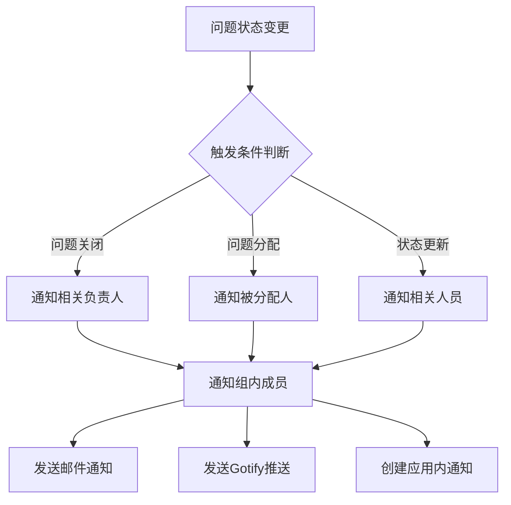

# ReBugTracker - 企业级缺陷跟踪系统


## 📋 项目简介

**ReBugTracker** 是一个基于 Flask 框架开发的现代化企业级缺陷跟踪系统，专为团队协作和问题管理而设计。系统采用模块化架构，支持多数据库部署，具备完整的用户权限管理、智能通知系统和数据分析功能。

### 🌟 核心特性

- 🔐 **多角色权限管理** - 管理员、负责人、组内成员、实施组四级权限体系
- 📊 **智能问题分配** - 基于产品线自动分配，支持手动调整
- 🔔 **多渠道通知系统** - 邮件、Gotify推送、应用内通知三重保障
- 📈 **数据可视化分析** - 交互式图表，支持多种导出格式
- 🗄️ **多数据库支持** - PostgreSQL/SQLite 可配置切换
- 📱 **响应式设计** - 完美适配桌面端和移动端

## 🛠️ 项目工具集

ReBugTracker 提供了丰富的工具集来支持开发、部署和维护：

### 数据库工具 (`database_tools/`)
- **sqlite_optimizer.py** - SQLite数据库性能优化
- **comprehensive_db_check.py** - 数据库完整性检查
- **create_notification_tables.py** - 通知表结构创建

### 数据库迁移工具 (`database_migration_tools/`)
- **sync_postgres_to_sqlite.py** - PostgreSQL到SQLite数据同步
- **sync_sqlite_to_postgres_data.py** - SQLite到PostgreSQL数据同步
- **verify_migration.py** - 迁移验证工具

### 部署工具 (`deployment_tools/`)
- **run_waitress.py** - Waitress WSGI服务器启动脚本
- **start.sh / start.bat** - 跨平台启动脚本
- **setup_venv.sh** - 虚拟环境自动设置

### 测试套件 (`test/`)
- **notification_tests/** - 通知系统测试
- **core_tests/** - 核心功能测试
- **ui_tests/** - 用户界面测试

## 🏗️ 系统架构

### 技术栈

| 组件 | 技术选型 | 版本要求 |
|------|----------|----------|
| 后端框架 | Flask | >= 2.0 |
| 数据库 | PostgreSQL / SQLite | >= 12.0 / >= 3.35 |
| 前端框架 | Bootstrap | 5.x |
| 图表库 | Chart.js | >= 3.0 |
| Python | Python | >= 3.8 |

### 目录结构

```
ReBugTracker/
├── rebugtracker.py              # 主程序入口
├── config.py                    # 系统配置
├── db_factory.py               # 数据库连接工厂
├── sql_adapter.py              # SQL语句适配器
├── requirements.txt             # Python依赖
├── README.md                   # 项目文档
├── notification/               # 通知系统模块
│   ├── __init__.py
│   ├── notification_manager.py # 通知管理器
│   ├── cleanup_manager.py      # 清理管理器
│   ├── flow_rules.py          # 流转规则
│   ├── simple_notifier.py     # 简单通知器
│   └── channels/              # 通知渠道
│       ├── __init__.py
│       ├── base.py           # 基础通知类
│       ├── email_notifier.py # 邮件通知
│       ├── gotify_notifier.py # Gotify通知
│       └── inapp_notifier.py # 应用内通知
├── templates/                 # 前端模板
│   ├── admin/                # 管理员页面
│   ├── admin.html           # 管理员主页
│   ├── user_settings.html   # 用户设置
│   ├── index.html           # 首页
│   ├── login.html           # 登录页
│   ├── base.html            # 基础模板
│   └── ...                  # 其他页面模板
├── static/                   # 静态资源
│   ├── css/                 # 样式文件目录 (当前为空，建议重构)
│   ├── js/                  # JavaScript文件目录 (当前为空，建议重构)
│   ├── RBT.ico             # 应用图标
│   └── rbt_title.ico       # 标题栏图标
├── uploads/                 # 文件上传目录
├── database_tools/          # 数据库工具集
│   ├── README.md           # 工具说明文档
│   ├── sqlite_optimizer.py # SQLite优化工具
│   └── ...                 # 其他数据库工具
├── database_migration_tools/ # 数据库迁移工具
│   ├── README.md           # 迁移工具说明
│   ├── sync_postgres_to_sqlite.py # PostgreSQL到SQLite同步
│   └── ...                 # 其他迁移工具
├── deployment_tools/        # 部署工具
│   ├── README.md           # 部署说明
│   └── run_waitress.py     # Waitress服务器启动脚本
├── test/                   # 测试套件
│   ├── README.md           # 测试说明
│   ├── notification_tests/ # 通知系统测试
│   ├── core_tests/         # 核心功能测试
│   └── ...                 # 其他测试模块
├── docs/                   # 项目文档
│   └── notification_priority_system_guide.md # 通知优先级指南
├── logs/                   # 日志目录
├── data_exports/           # 数据导出目录
├── docker-compose.yml      # Docker Compose配置
├── Dockerfile             # Docker镜像配置
├── nginx.conf             # Nginx配置示例
├── start.sh               # Linux启动脚本
├── start.bat              # Windows启动脚本
└── setup_venv.sh          # 虚拟环境设置脚本
```

## 🚀 快速开始

### 环境要求

- Python 3.8+
- PostgreSQL 12+ 或 SQLite 3.35+
- 4GB+ RAM
- 10GB+ 磁盘空间

### 安装步骤

1. **克隆项目**
```bash
git clone https://github.com/your-repo/ReBugTracker.git
cd ReBugTracker
```

2. **创建虚拟环境**
```bash
python -m venv .venv
# Windows
.venv\Scripts\activate
# Linux/Mac
source .venv/bin/activate
```

3. **安装依赖**
```bash
pip install -r requirements.txt
```

4. **配置数据库**

**PostgreSQL 配置** (推荐生产环境)
```python
# config.py
DB_TYPE = 'postgres'
POSTGRES_CONFIG = {
    'dbname': 'rebugtracker',
    'user': 'postgres',
    'password': 'your_password',
    'host': 'localhost',
    'port': 5432
}
```

**SQLite 配置** (适合开发/测试)
```python
# config.py
DB_TYPE = 'sqlite'
SQLITE_CONFIG = {
    'database': 'rebugtracker.db'
}
```

5. **启动应用**
```bash
python rebugtracker.py
```

6. **访问系统**
```
http://127.0.0.1:5000
```

### 默认管理员账户

- **用户名**: `admin`
- **密码**: `admin`

> ⚠️ **安全提醒**: 首次登录后请立即修改默认密码！

## 👥 用户角色与权限

### 角色体系

| 角色 | 代码 | 权限描述 |
|------|------|----------|
| 管理员 | `gly` | 系统全权管理、用户管理、通知配置、数据报表 |
| 负责人 | `fzr` | 问题分配、团队管理、报表查看、状态监控 |
| 组内成员 | `zncy` | 问题处理、状态更新、解决方案提交 |
| 实施组 | `ssz` | 问题提交、进度跟踪、状态查询 |

### 权限矩阵

| 功能模块 | 管理员 | 负责人 | 组内成员 | 实施组 |
|----------|--------|--------|----------|--------|
| 用户管理 | ✅ | ❌ | ❌ | ❌ |
| 问题提交 | ❌ | ❌ | ❌ | ✅ |
| 问题分配 | ❌ | ✅ | ❌ | ❌ |
| 问题处理 | ❌ | ✅ | ✅ | ❌ |
| 数据报表 | ✅ | ❌ | ❌ | ❌ |
| 通知配置 | ✅ | ❌ | ❌ | ❌ |

## 🔔 通知系统

### 通知渠道

#### 1. 邮件通知
- **配置路径**: 管理员 → 通知管理 → 邮件配置
- **支持协议**: SMTP/SMTPS
- **模板支持**: HTML邮件模板
- **功能特性**: 批量发送、失败重试

#### 2. Gotify 推送
- **实时推送**: 支持移动端实时通知
- **优先级设置**: 可配置通知优先级(默认10)
- **Token管理**: 用户个人Token配置
- **消息分类**: 支持应用分组

#### 3. 应用内通知
- **消息中心**: 系统内置消息管理
- **实时更新**: 页面自动刷新通知
- **状态跟踪**: 已读/未读状态管理
- **历史记录**: 完整的通知历史

### 通知流转规则



### 自动清理机制

- **过期清理**: 自动清理30天前的通知记录
- **超量清理**: 单用户通知数量超过1000条时自动清理
- **定时任务**: 每24小时执行一次清理任务
- **手动清理**: 管理员可手动触发清理操作

## 📊 数据分析与报表

### 交互式图表

#### 图表类型
- **折线图**: 趋势分析，时间序列数据
- **柱状图**: 对比分析，分类统计
- **饼状图**: 占比分析，构成比例

#### 统计维度
- **提交人统计**: 按提交人统计已完成问题数量
- **处理人统计**: 按处理人统计已完成问题数量
- **产品线分析**: 按产品线分布统计
- **时间趋势**: 按时间维度的趋势分析

#### 时间范围
- **本周**: 当前周的数据统计
- **本月**: 当前月的数据统计  
- **本年**: 当前年的数据统计
- **全部**: 历史全部数据统计

### 导出功能

#### Excel 导出
- **自定义字段**: 可选择导出字段
- **数据格式**: 标准Excel格式(.xlsx)
- **中文支持**: 完美支持中文字符
- **批量导出**: 支持大量数据导出

#### 图表导出
- **格式支持**: PNG格式
- **背景选择**: 白色背景/透明背景可选
- **高清输出**: 支持高分辨率导出
- **文件命名**: 自动生成时间戳文件名

## 🛠️ 配置管理

### 环境变量配置

```bash
# 数据库配置
export DB_TYPE=postgres
export DATABASE_NAME=rebugtracker
export DATABASE_USER=postgres
export DATABASE_PASSWORD=your_password
export DATABASE_HOST=localhost
export DATABASE_PORT=5432

# SQLite配置 (可选)
export SQLITE_DB_PATH=rebugtracker.db
```

### 应用配置

```python
# config.py 主要配置项

# 数据库类型
DB_TYPE = 'postgres'  # 或 'sqlite'

# 文件上传配置
ALLOWED_EXTENSIONS = {'png', 'jpg', 'jpeg', 'gif'}
MAX_CONTENT_LENGTH = 16 * 1024 * 1024  # 16MB

# 安全配置
SECRET_KEY = 'your-secret-key-here'  # 生产环境请修改
```

## ⚠️ 前端架构现状与改进建议

### 🔍 当前架构问题

**重要提醒**: 当前项目的CSS和JavaScript代码全部内联在HTML模板中，存在以下问题：

#### 问题分析
- **代码重复**: 相同样式在多个模板中重复定义
- **维护困难**: 修改样式需要在多个文件中同步更改
- **性能问题**: 无法利用浏览器缓存，页面加载慢
- **开发效率**: 代码复用性差，团队协作困难

#### 文件规模统计
| 模板文件 | 行数 | 大小 | 主要内容 |
|----------|------|------|----------|
| admin.html | 4,497行 | 207KB | 管理员界面 + 大量内联CSS/JS |
| index.html | 1,936行 | 69KB | 首页 + 内联样式和脚本 |
| team_issues.html | 1,616行 | 56KB | 团队问题页面 + 内联代码 |

### 🚀 建议的重构方案

#### 1. 静态资源分离
```
static/
├── css/
│   ├── base.css           # 基础样式
│   ├── components.css     # 组件样式
│   ├── admin.css         # 管理员页面样式
│   └── themes.css        # 主题样式
├── js/
│   ├── common.js         # 公共函数
│   ├── charts.js         # 图表相关
│   ├── notifications.js  # 通知系统
│   └── admin.js          # 管理员功能
```

#### 2. 模块化重构优先级
1. **高优先级**: 提取公共CSS样式 (按钮、表单、模态框)
2. **中优先级**: 分离JavaScript功能模块
3. **低优先级**: 优化和压缩静态资源

#### 3. 重构收益预估
- **性能提升**: 页面加载速度提升30-50%
- **维护效率**: 代码修改效率提升70%
- **开发体验**: 支持热重载、代码提示等现代开发工具

## 🔧 开发指南

### 本地开发环境搭建

1. **安装开发依赖**
```bash
pip install -r requirements-dev.txt
```

2. **配置开发数据库**
```python
# 使用SQLite进行本地开发
DB_TYPE = 'sqlite'
SQLITE_CONFIG = {
    'database': 'dev_rebugtracker.db'
}
```

3. **启动开发服务器**
```bash
python rebugtracker.py
```

### 代码规范

- **PEP 8**: 遵循Python代码规范
- **函数文档**: 所有函数必须包含docstring
- **异常处理**: 完善的异常捕获和处理
- **日志记录**: 关键操作必须记录日志

### 数据库迁移

#### PostgreSQL 初始化
```sql
-- 创建数据库
CREATE DATABASE rebugtracker;

-- 创建用户表
CREATE TABLE users (
    id SERIAL PRIMARY KEY,
    username VARCHAR(50) UNIQUE NOT NULL,
    chinese_name VARCHAR(100),
    password VARCHAR(255) NOT NULL,
    email VARCHAR(100),
    phone VARCHAR(20),
    role VARCHAR(20),
    role_en VARCHAR(10),
    team VARCHAR(50),
    team_en VARCHAR(50),
    created_at TIMESTAMP DEFAULT CURRENT_TIMESTAMP
);

-- 创建问题表
CREATE TABLE bugs (
    id SERIAL PRIMARY KEY,
    title VARCHAR(200) NOT NULL,
    description TEXT,
    status VARCHAR(20) DEFAULT '待处理',
    project VARCHAR(100),
    created_by INTEGER REFERENCES users(id),
    assigned_to INTEGER REFERENCES users(id),
    created_at TIMESTAMP DEFAULT CURRENT_TIMESTAMP,
    resolved_at TIMESTAMP,
    resolution TEXT,
    image_path TEXT
);
```

## 🚀 部署指南

### 生产环境部署

#### 1. 服务器要求
- **操作系统**: Ubuntu 20.04+ / CentOS 8+ / Windows Server 2019+
- **内存**: 4GB+ RAM
- **存储**: 20GB+ 可用空间
- **网络**: 稳定的网络连接

#### 2. 使用 Gunicorn 部署

```bash
# 安装 Gunicorn
pip install gunicorn

# 启动应用
gunicorn -w 4 -b 0.0.0.0:5000 rebugtracker:app
```

#### 3. 使用 Nginx 反向代理

```nginx
server {
    listen 80;
    server_name your-domain.com;

    location / {
        proxy_pass http://127.0.0.1:5000;
        proxy_set_header Host $host;
        proxy_set_header X-Real-IP $remote_addr;
        proxy_set_header X-Forwarded-For $proxy_add_x_forwarded_for;
    }

    location /static {
        alias /path/to/ReBugTracker/static;
    }

    location /uploads {
        alias /path/to/ReBugTracker/uploads;
    }
}
```

#### 4. 使用 Docker 部署

```dockerfile
FROM python:3.9-slim

WORKDIR /app
COPY requirements.txt .
RUN pip install -r requirements.txt

COPY . .
EXPOSE 5000

CMD ["gunicorn", "-w", "4", "-b", "0.0.0.0:5000", "rebugtracker:app"]
```

```yaml
# docker-compose.yml
version: '3.8'
services:
  app:
    build: .
    ports:
      - "5000:5000"
    environment:
      - DB_TYPE=postgres
      - DATABASE_HOST=db
    depends_on:
      - db

  db:
    image: postgres:13
    environment:
      - POSTGRES_DB=rebugtracker
      - POSTGRES_USER=postgres
      - POSTGRES_PASSWORD=password
    volumes:
      - postgres_data:/var/lib/postgresql/data

volumes:
  postgres_data:
```

### 性能优化

#### 数据库优化
```sql
-- PostgreSQL 索引优化
CREATE INDEX idx_bugs_status ON bugs(status);
CREATE INDEX idx_bugs_assigned_to ON bugs(assigned_to);
CREATE INDEX idx_bugs_created_at ON bugs(created_at);
CREATE INDEX idx_users_username ON users(username);
```

#### 应用优化
- **连接池**: 使用数据库连接池
- **缓存**: 静态资源缓存配置
- **压缩**: 启用Gzip压缩
- **CDN**: 静态资源CDN加速

## 🔍 故障排除

### 常见问题

#### 1. 数据库连接失败
```bash
# 检查数据库服务状态
sudo systemctl status postgresql

# 检查连接配置
psql -h localhost -U postgres -d rebugtracker
```

#### 2. 端口被占用
```bash
# 查看端口占用
netstat -ano | findstr :5000

# 杀死占用进程
taskkill /F /PID <进程ID>
```

#### 3. 权限问题
```bash
# 检查文件权限
ls -la uploads/
chmod 755 uploads/
```

#### 4. 通知发送失败
- 检查邮件服务器配置
- 验证Gotify服务器连接
- 查看应用日志文件

#### 5. 前端样式问题
- **样式冲突**: 由于内联CSS，可能出现样式覆盖问题
- **JavaScript错误**: 检查浏览器控制台错误信息
- **缓存问题**: 清除浏览器缓存或使用硬刷新 (Ctrl+F5)

### 日志分析

```python
# 启用详细日志
import logging
logging.basicConfig(level=logging.DEBUG)

# 查看应用日志
tail -f rebugtracker.log
```

## 🤝 贡献指南

### 参与贡献

1. **Fork 项目**
2. **创建特性分支** (`git checkout -b feature/AmazingFeature`)
3. **提交更改** (`git commit -m 'Add some AmazingFeature'`)
4. **推送分支** (`git push origin feature/AmazingFeature`)
5. **创建 Pull Request**

### 开发规范

- 遵循现有代码风格
- 添加适当的测试用例
- 更新相关文档
- 确保所有测试通过

## 📄 许可证

本项目采用 MIT 许可证 - 查看 [LICENSE](LICENSE) 文件了解详情。

## 📞 支持与联系

- **项目主页**: [GitHub Repository](https://github.com/bjkdgh/ReBugTracker)
- **问题反馈**: [Issues](https://github.com/bjkdgh/ReBugTracker/issues)
- **功能建议**: [Discussions](https://github.com/bjkdgh/ReBugTracker/discussions)

## 🙏 致谢

感谢所有为 ReBugTracker 项目做出贡献的开发者和用户！

---

**ReBugTracker** - 让缺陷跟踪更简单、更高效！ 🚀
