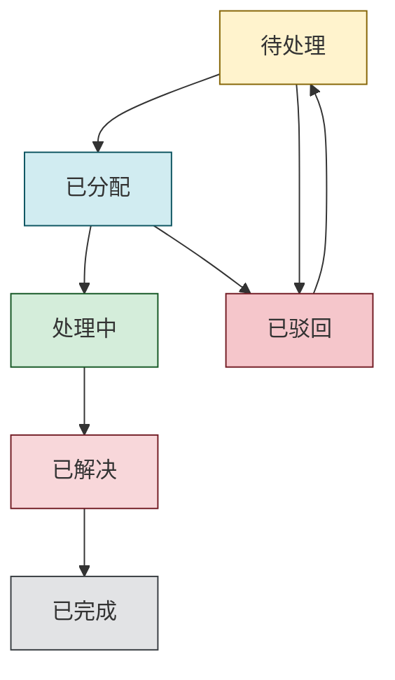

# ReBugTracker 问题状态工作流程指南

## 📋 概述

ReBugTracker 采用完整的问题生命周期管理，支持从问题提交到最终完成的全流程状态跟踪。系统包含六个核心状态，支持驳回机制，确保问题处理的质量和效率。

## 🔄 状态定义

### 1. 待处理 (Pending)
- **描述**：新提交的问题，等待负责人分配
- **触发条件**：实施组提交新问题
- **可执行操作**：
  - ✅ 分配给组内成员（负责人）
  - ✅ 驳回问题（负责人）
- **权限要求**：负责人角色
- **通知对象**：负责人

### 2. 已分配 (Assigned)
- **描述**：问题已分配给具体的处理人员
- **触发条件**：负责人将问题分配给组内成员
- **可执行操作**：
  - ✅ 开始处理（组内成员）
  - ✅ 驳回问题（负责人）
- **权限要求**：组内成员、负责人
- **通知对象**：被分配的组内成员

### 3. 处理中 (Processing)
- **描述**：问题正在被处理中
- **触发条件**：组内成员开始处理问题
- **可执行操作**：
  - ✅ 标记为已解决（组内成员）
- **权限要求**：组内成员
- **通知对象**：问题创建者、负责人

### 4. 已解决 (Resolved)
- **描述**：问题已解决，等待实施组确认
- **触发条件**：组内成员完成问题处理
- **可执行操作**：
  - ✅ 确认闭环（实施组）
- **权限要求**：实施组（问题创建者）
- **通知对象**：问题创建者、负责人

### 5. 已驳回 (Rejected) 🆕
- **描述**：问题被驳回，需要重新评估或修改
- **触发条件**：负责人驳回待处理或已分配的问题
- **驳回原因**：
  - 问题描述不清晰
  - 重复提交
  - 不属于系统问题
  - 缺少必要信息
  - 优先级不符合要求
- **可执行操作**：
  - ✅ 修改问题后重新提交（实施组）
  - ✅ 查看驳回原因（所有角色）
- **权限要求**：实施组可重新提交
- **通知对象**：问题创建者、原分配者（如有）

### 6. 已完成 (Completed)
- **描述**：问题已确认完成，流程结束
- **触发条件**：实施组确认问题解决方案
- **可执行操作**：
  - ✅ 查看历史记录（所有角色）
  - ✅ 数据统计分析（管理员）
- **权限要求**：所有角色可查看
- **通知对象**：所有相关人员

## 🔄 状态流转图

## 🚫 驳回功能详解

### 驳回条件
- **适用状态**：仅限"待处理"和"已分配"状态
- **执行权限**：负责人角色
- **必填信息**：驳回原因

### 驳回流程
1. **负责人操作**：在问题详情页点击"驳回问题"按钮
2. **填写原因**：在弹出框中详细说明驳回原因
3. **系统处理**：
   - 更新问题状态为"已驳回"
   - 记录驳回原因和时间
   - 发送通知给相关人员
4. **后续处理**：实施组收到通知后可修改问题重新提交

### 驳回原因示例
- **描述不清**："问题描述过于简单，请提供详细的复现步骤"
- **重复问题**："该问题与 #123 重复，请查看已有问题"
- **非系统问题**："这是用户操作问题，不属于系统缺陷"
- **信息不足**："请提供错误截图和具体的操作环境"
- **优先级错误**："该问题优先级过高，建议调整为普通问题"

### 重新提交
- **修改权限**：问题创建者（实施组）
- **修改内容**：可修改标题、描述、类型、所属项目等
- **状态变更**：重新提交后状态自动变为"待处理"
- **历史记录**：保留驳回记录和修改历史

## 👥 角色权限矩阵

| 状态 | 实施组 | 组内成员 | 负责人 | 管理员 |
|------|--------|----------|--------|--------|
| 待处理 | 查看 | 查看 | 分配、驳回 | 全部权限 |
| 已分配 | 查看 | 开始处理 | 驳回 | 全部权限 |
| 处理中 | 查看 | 标记解决 | 查看 | 全部权限 |
| 已解决 | 确认闭环 | 查看 | 查看 | 全部权限 |
| 已驳回 | 重新提交 | 查看 | 查看 | 全部权限 |
| 已完成 | 查看 | 查看 | 查看 | 全部权限 |

## 📊 状态统计

### 状态分布
系统提供实时的状态统计功能：
- **待处理问题数**：需要及时分配的问题
- **处理中问题数**：正在处理的问题
- **已驳回问题数**：需要重新处理的问题
- **已完成问题数**：已完成的问题总数

### 驳回率分析
- **整体驳回率**：驳回问题数 / 总提交问题数
- **按人员统计**：各实施组成员的驳回率
- **按时间统计**：不同时期的驳回率趋势
- **驳回原因分析**：常见驳回原因统计

## 🔔 通知机制

### 状态变更通知
每次状态变更都会触发相应的通知：

| 状态变更 | 通知对象 | 通知内容 | 优先级 |
|----------|----------|----------|--------|
| 提交问题 | 负责人 | 新问题待分配 | 重要 |
| 分配问题 | 组内成员 | 问题已分配给您 | 紧急 |
| 驳回问题 | 创建者、原分配者 | 问题被驳回 | 紧急 |
| 开始处理 | 创建者、负责人 | 问题处理中 | 普通 |
| 标记解决 | 创建者、负责人 | 问题已解决 | 重要 |
| 确认闭环 | 所有相关人员 | 问题已完成 | 普通 |

### 通知渠道
- **应用内通知**：系统内置消息中心
- **邮件通知**：发送到用户邮箱
- **Gotify推送**：移动端实时推送

## 🛠️ 最佳实践

### 问题提交建议
1. **标题明确**：简洁描述问题核心
2. **描述详细**：包含复现步骤、预期结果、实际结果
3. **附加截图**：提供错误截图或操作截图
4. **选择正确项目**：确保问题归属正确

### 驳回操作建议
1. **明确原因**：详细说明驳回的具体原因
2. **提供指导**：给出改进建议或参考资料
3. **及时处理**：避免问题长时间停留在待处理状态
4. **友好沟通**：使用建设性的语言

### 状态管理建议
1. **及时更新**：处理进展及时更新状态
2. **详细记录**：在解决方案中详细记录处理过程
3. **质量把控**：确保问题真正解决后再标记为已解决
4. **闭环确认**：实施组应认真验证解决方案

---

**文档版本**：v2.1  
**最后更新**：2025-07-26  
**维护者**：ReBugTracker开发团队
