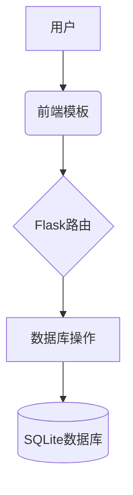

# 系统架构文档

## 核心模块
1. 身份验证系统
   - 路由：/login, /register, /logout
   - 数据库表：users

2. 问题跟踪系统
   - 路由：/submit, /bug/<id>
   - 数据库表：bugs

3. 后台管理系统
   - 路由：/admin, /team_issues

## 数据流转图

生成时间：2025-06-28 12:07:34
