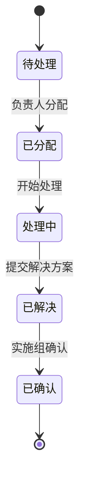

# 需求/Bug跟踪系统设计说明书

## 文档版本
| 版本 | 日期       | 修改说明           | 作者   |
|------|------------|--------------------|--------|
| 1.0  | 2025-06-29 | 初始版本           | gh     |
| 1.1  | 2025-06-29 | 增加安全设计章节   | gh     |
| 1.2  | 2025-06-29 | 更新角色映射关系   | Cline  |
| 1.3  | 2025-06-29 | 完善索引设计       | Cline  |

## 1. 数据库设计

### 1.1 核心表结构
```mermaid
erDiagram
    users ||--o{ bugs : "created_by"
    users ||--o{ bugs : "assigned_to"
    product_lines ||--o{ bugs : "product_line"  // 产品线与问题的1:N关系
    
    product_lines {
        int id PK "产品线ID"
        string(50) name "产品线名称（唯一）"
        string(100) owner "负责人（关联users.username）"
        datetime create_time "创建时间"
    }
    
    users {
        int id PK "用户ID，自增主键"	
        string(50) username "登录用户名，唯一索引"
        string(120) password "加密后的密码（BCrypt）"
        string(20) role "角色：admin-管理员（系统创建）/manager-负责人/product_member-组内成员"
        string(20) approval_status "审批状态：pending-待审批/approved-已通过"
        string(50) product_line "所属产品线"
        datetime create_time "账户创建时间，默认当前时间"
    }
    
    bugs {
        int id PK "问题ID，自增主键"
        string(100) title "问题标题，非空"
        text description "详细描述，支持Markdown格式"
        string(20) status "状态：待处理/已分配/处理中/已解决/已确认"
        int assigned_to FK "关联users.id，处理人"
        int created_by FK "关联users.id，创建人"
        string(50) product_line "所属产品线（外键）"
        string(100) project "所属项目（自由文本）"
        datetime created_at "创建时间，默认当前时间"
        datetime resolved_at "解决时间"
        text resolution "解决方案说明"
        string(200) image_path "附件图片存储路径"
    }
```

### 1.2 索引设计规范
| 表名           | 索引字段               | 索引类型 | 说明                     |
|----------------|------------------------|----------|--------------------------|
| product_lines  | name                   | 唯一索引 | 确保产品线名称唯一       |
| users          | username               | 唯一索引 | 登录账号唯一性约束       |
| users          | product_line+role      | 联合索引 | 按产品线和角色快速查询   |
| bugs           | product_line+status    | 联合索引 | 按产品线和状态快速过滤   |
| bugs           | created_at             | 普通索引 | 按创建时间排序查询       |
| bugs           | assigned_to+status     | 联合索引 | 处理人任务状态查询       |

### 1.3 状态流转图


## 2. 业务逻辑设计

### 2.1 权限控制矩阵
| 操作                | submitter | product_member | manager | admin |
|---------------------|-----------|-----------------|---------|-------|
| 注册用户            | ✓         |                 |         |       |
| 提交问题            | ✓         |                 |         | ✓     |
| 分配问题            |           |                 | ✓       | ✓     |
| 处理问题            |           | ✓               |         |       |
| 确认解决方案        | ✓         |                 |         | ✓     |
| 管理用户            |           |                 |         | ✓     |
| 查看所有问题        |           |                 | ✓       | ✓     |

### 2.2 核心业务流程
**问题处理流程：**
1. 实施组成员提交问题（状态：待处理）
2. 负责人分配问题给组内成员（状态：已分配）
3. 组内成员处理问题（状态：处理中）
4. 提交解决方案（状态：已解决）
5. 实施组成员确认闭环（状态：已确认）

**用户权限变更流程：**
1. 管理员创建基础账号
2. 负责人分配组内成员
3. 系统自动同步权限配置
4. 权限变更记录审计日志

## 3. 界面设计规范

### 3.1 问题列表页


### 3.2 问题详情页
| 区域       | 组件                 | 功能说明                     |
|------------|----------------------|------------------------------|
| 头部       | 标题栏               | 显示问题标题和状态标签       |
| 主体       | Markdown编辑器       | 问题描述和解决方案编辑       |
| 侧边栏     | 元信息面板           | 显示创建时间、负责人等信息   |
| 底部       | 操作按钮组           | 分配、解决、确认等操作       |

## 4. 安全设计

### 4.1 数据加密策略
| 数据类型       | 加密方式                | 备注                         |
|----------------|-------------------------|------------------------------|
| 用户密码       | BCrypt哈希             | 强度因子12                   |
| 会话令牌       | HS256签名              | 有效期30分钟                 |
| 敏感操作日志   | AES-256-GCM            | 日志存储加密                 |

### 4.2 审计日志规范
```json
{
  "timestamp": "2025-06-29T12:00:00+08:00",
  "user": "gh",
  "action": "问题分配",
  "target": "BUG-001",
  "ip": "192.168.1.100",
  "details": {
    "from": "待处理",
    "to": "已分配",
    "assignee": "zjn"
  }
}
```

## 5. 非功能性需求

### 5.1 性能指标
| 指标项           | 要求值       | 测试条件                 |
|-------------------|--------------|--------------------------|
| 列表页响应时间    | ≤800ms       | 1000条数据量             |
| 并发用户数        | ≥50          | 典型业务场景             |
| 数据导出速度      | ≤3s/万条     | CSV格式导出              |

### 5.2 可靠性要求
1. 关键操作事务保证（如问题状态变更）
2. 每日自动数据库备份（保留最近7天）
3. 异常自动告警机制（短信/邮件通知）

## 6. 部署架构

### 6.1 系统拓扑图
```mermaid
graph TD
    A[客户端] --> B(Nginx负载均衡)
    B --> C[应用服务器1]
    B --> D[应用服务器2]
    C --> E[(主数据库)]
    D --> E
    E --> F[备份数据库]
    style E fill:#f9f,stroke:#333
